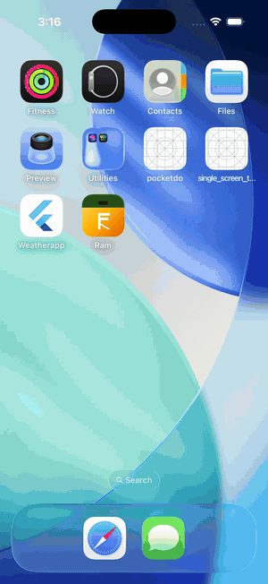

# Ram — FlickTV Assignment

**Package:** `flicktv.ram` &nbsp;·&nbsp; **App name:** `Ram` &nbsp;·&nbsp; **Version:** `1.0.0`

---

## Download APK

[](https://github.com/ram7767/FlickTV-Interview-assignment/releases/latest/download/final_result.apk)

---

## Screen Recording



[Watch full recording](https://drive.google.com/file/d/1fwuADgYPL8H0oOu487JM97v66eipsdOz/view?usp=sharing)

---

## Tech Stack

- **Flutter / Dart** — no third-party packages used
- **Clean Architecture** — Domain → Data → Presentation
- **CustomPainter** — confetti animation & custom UI components
- **Animations** — hero transitions, animated lists, custom app bar

---

## Run Locally

```bash
flutter pub get
flutter run
```
